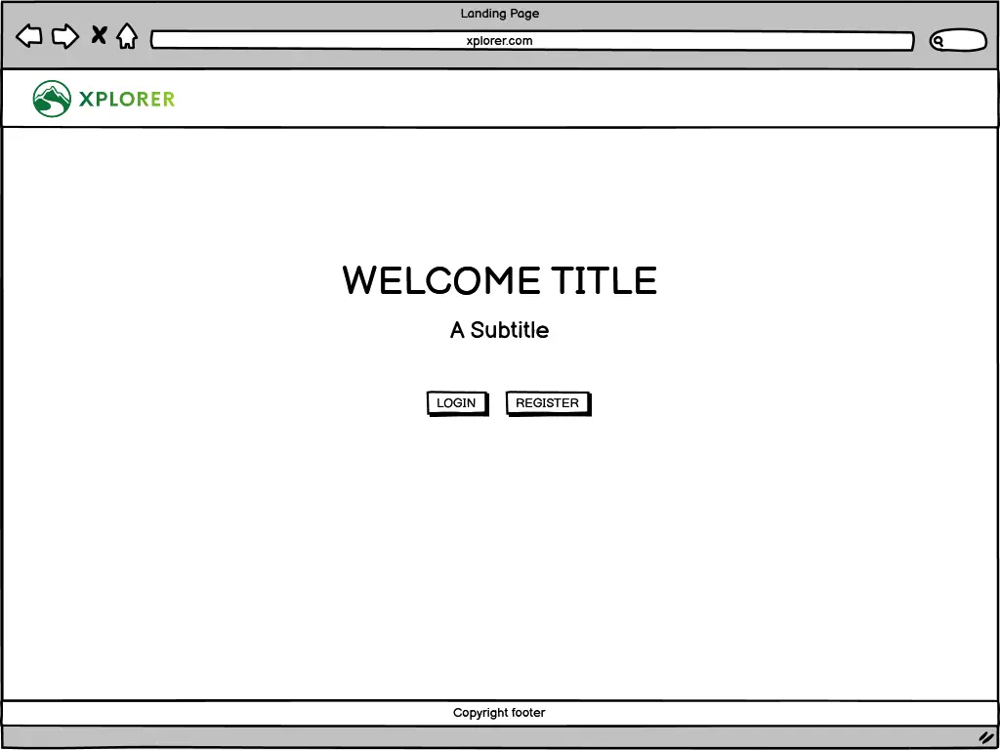
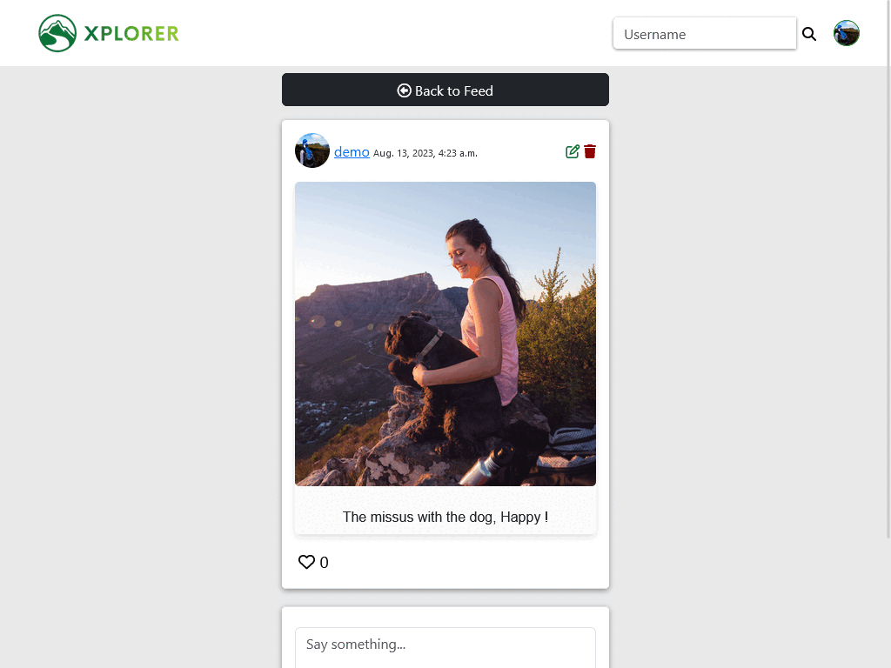

## Introduction

XPLORER is a social media platform built using Django, JavaScript, CSS, and HTML. It's a space for users to share their experiences, photos, and stories with others from all over the world. Whether you want to show off a great spot you visited, share a personal thought, or give a recommendation, XPLORER is the place to do it.

This platform is a project for the Code Institute Diploma in Software Development with eCommerce. On XPLORER, users can sign up, and create, edit, or delete their own posts and comments. They can also set up and manage their personal profiles. Join XPLORER and connect with a community eager to share and explore.

---

[View the live website on Heroku](https://xplorer-p4-ad2c5b0b95ce.herokuapp.com)

Please note: To open any links in this document in a new browser tab, please press CTRL + Click.

## Table of Contents

* [The Strategy Plane](#the-strategy-plane)
  * [The Sites Ideal User](#the-sites-ideal-user)
  * [Site Goals](#site-goals)
  * [Epics](#epics)
  * [User Stories](#user-stories)
* [The Scope Plane](#the-scope-plane)
* [The Structure Plane](#the-structure-plane)
* [The Skeleton Plane](#the-skeleton-plane)
  * [Wireframe Mock-ups](#wireframe-mock-ups)
  * [Database Schema](#database-schema)
* [The Surface Plane](#the-surface-plane)
  * [Design](#design)
  * [Typography](#typography)
* [Features](#features)
* [Future Enhancements](#future-enhancements)
* [Testing](#testing)
* [Bugs](#bugs)
* [Technologies Used](#technologies-used)
* [Credits](#credits)
* [Deployment](#deployment)
* [Acknowledgements](#acknowledgements)

## UX

## The Strategy Plane

* XPLORER is designed to be a welcoming online hub where users can share, discover, and engage with intriguing experiences and adventures. Not only can members dive into stories shared by peers from every corner of the globe, but they can also show their appreciation by liking or unliking posts. Want to stay updated with your favorite XPLORER storytellers? Simply follow other users to get their latest tales right in your feed.

### The Sites Ideal User

* Someone who is passionate about sharing their unique travels and experiences.
* Someone who wants to expand their knowledge of global stories, adventures, and local experiences.
* Someone who draws inspiration from the shared stories.
* Someone eager to grow their online presence by consistently sharing, engaging.

### Site Goals

* To provide users with a platform to share their unique adventures and stories.
* To provide users with a space to connect with and follow fellow explorers.
* To provide users with a hub to draw inspiration from diverse experiences around the world.

### Epics

**10 Epics** were created which were then further developed into 31 User Stories. The details on each epic, along with the user stories linked to each one can be found in the project [kanban board](https://github.com/users/kpetrauskas92/projects/1)

1. User Registration [#1](https://github.com/kpetrauskas92/XPLORER/issues/1)
2. User Login [#2](https://github.com/kpetrauskas92/XPLORER/issues/2)
3. User Profile [#3](https://github.com/kpetrauskas92/XPLORER/issues/3)
4. Post Creation [#4](https://github.com/kpetrauskas92/XPLORER/issues/4)
5. Like Posts & Comments [#5](https://github.com/kpetrauskas92/XPLORER/issues/5)
6. Comment Reply [#6](https://github.com/kpetrauskas92/XPLORER/issues/55)
7. News Feed [#7](https://github.com/kpetrauskas92/XPLORER/issues/6)
8. User Follow/Unfollow [#8](https://github.com/kpetrauskas92/XPLORER/issues/7)
9. User Search [#9](https://github.com/kpetrauskas92/XPLORER/issues/8)
10. User Logout [#10](https://github.com/kpetrauskas92/XPLORER/issues/11)

---

[Back to top](<#table-of-contents>)

---

## User Stories

From the Epics, 31 User stories were developed. Each story was assigned a classification of Must-Have, Should-Have, Could-Have or Won't Have. The full list of User Stories, seperated by those completed and those pushed to a future release is available on the project [kanban board](https://github.com/users/kpetrauskas92/projects/1).

These are all the USER STORIES that were introduced for this project. Sorted by EPIC

VIEW

### **1. User Registration**

* USER STORY [#26](https://github.com/kpetrauskas92/XPLORER/issues/26)

    Basic Registration
  * As a new user, I want to register for an account so that I can access the platform's features.

* USER STORY [#28](https://github.com/kpetrauskas92/XPLORER/issues/28)

    Verification *Won't Have*
  * As a registered user, I want my profile to be verified so that other users can trust the authenticity of my profile.

* USER STORY [#29](https://github.com/kpetrauskas92/XPLORER/issues/29)

    Social Media Integration *Won't Have*
  * As a user, I want to register on the platform using my social media accounts so that I can simplify the sign-up process and quickly join the community.

### **2. User Login**

* USER STORY [#30](https://github.com/kpetrauskas92/XPLORER/issues/30)

    Standard Login
  * As a registered user, I want to log in using my username/email and password so that I can securely access my account.

* USER STORY [#31](https://github.com/kpetrauskas92/XPLORER/issues/31)

    Forgotten Password *Won't Have*
  * As a user who has forgotten my password, I want to reset it so that I can regain access to my account.

* USER STORY [#32](https://github.com/kpetrauskas92/XPLORER/issues/32)

    Remember Me Option
  * As a user logging in, I want the platform to remember my session so that I don't have to log in every time I visit.

### **3. User Login**

* USER STORY [#33](https://github.com/kpetrauskas92/XPLORER/issues/33)

    Viewing Profile
  * As a registered user, I want to log in using my username/email and password so that I can securely access my account.

* USER STORY [#34](https://github.com/kpetrauskas92/XPLORER/issues/34)

    Editing Profile Details
  * As a registered user, I want to edit my profile information so that I can keep my details up-to-date.

* USER STORY [#35](https://github.com/kpetrauskas92/XPLORER/issues/35)

    Changing Profile Picture
  * As a registered user, I want to change my profile picture so that I can personalize my profile.

* USER STORY [#36](https://github.com/kpetrauskas92/XPLORER/issues/36)

    Setting Profile Preferences
  * As a registered user, I want to set preferences in my profile so that I can customize my experience on the platform.

* USER STORY [#40](https://github.com/kpetrauskas92/XPLORER/issues/40)

    Profile Deletion
  * As a registered user, I want to delete my profile so that my data and activities are permanently removed from the platform.

### **4. Post Creation**

* USER STORY [#37](https://github.com/kpetrauskas92/XPLORER/issues/37)

    Basic Post Creation
  * As a user, I want to create a post so that I can share content with others on the platform.

* USER STORY [#38](https://github.com/kpetrauskas92/XPLORER/issues/38)

    Adding Images to Post
  * As a user, I want to add images to my post so that my content can be more engaging and descriptive.

* USER STORY [#39](https://github.com/kpetrauskas92/XPLORER/issues/39)

    Tagging in Posts *Won't Have*
  * As a user, I want to add tags to my post so that it can be more discoverable to users interested in that topic.

* USER STORY [#41](https://github.com/kpetrauskas92/XPLORER/issues/41)

    Post Edit
  * As a user, I want to edit my previously created post so that I can correct mistakes or update its content.

### **5. Like Posts & Comments**

* USER STORY [#43](https://github.com/kpetrauskas92/XPLORER/issues/43)

    Like a Post
  * As a user, I want to like a post so that I can show appreciation for content I enjoy.

* USER STORY [#44](https://github.com/kpetrauskas92/XPLORER/issues/44)

    Like a Comment
  * As a user, I want to like a comment so that I can acknowledge or show agreement with it.

* USER STORY [#45](https://github.com/kpetrauskas92/XPLORER/issues/45)

    View Liked Content *Won't Have*
  * As a user, I want to view posts and comments I've previously liked so that I can revisit content that I enjoyed or found valuable.

### **6. Comment Reply**

* USER STORY [#56](https://github.com/kpetrauskas92/XPLORER/issues/56)

    Reply to a Comment
  * As a user, I want to reply directly to another user's comment so that I can interact in a threaded conversation and clarify or discuss specific points.

* USER STORY [#57](https://github.com/kpetrauskas92/XPLORER/issues/57)

    View Threaded Replies
  * As a user, I want to see replies in a threaded format under the original comment so that I can easily follow conversations and understand the context of each reply.
  
* USER STORY [#58](https://github.com/kpetrauskas92/XPLORER/issues/58)

    Delete Comment Reply
  * As a user, I want to be able to delete my reply so that I can remove comments I no longer want others to see or if I regret posting them.

### **7. News Feed**

* USER STORY [#46](https://github.com/kpetrauskas92/XPLORER/issues/46)

    View News Feed
  * As a user, I want to view a news feed so that I can see the latest posts and updates from people I follow and topics I'm interested in.

* USER STORY [#47](https://github.com/kpetrauskas92/XPLORER/issues/47)

    Interact with Feed Items
  * As a user, I want to interact with items on my news feed so that I can like, comment, or share them.

* USER STORY [#48](https://github.com/kpetrauskas92/XPLORER/issues/48)

    Customize News Feed *Won't Have*
  * As a user, I want to customize my news feed so that I can choose the type of content I want to see more or less of.

### **8. User Follow/Unfollow**

* USER STORY [#49](https://github.com/kpetrauskas92/XPLORER/issues/49)

    Follow a User
  * As a user, I want to follow another user so that I can see their posts and updates in my news feed.

* USER STORY [#50](https://github.com/kpetrauskas92/XPLORER/issues/50)

    Unfollow a User
  * As a user, I want to unfollow a user so that I no longer see their content in my news feed.

* USER STORY [#51](https://github.com/kpetrauskas92/XPLORER/issues/51)

    View Followers and Following Lists *Won't Have*
  * As a user, I want to view lists of users who follow me and users I am following so that I can manage and understand my network on the platform.

### **9. User Search**

* USER STORY [#52](https://github.com/kpetrauskas92/XPLORER/issues/52)

    Basic User Search
  * As a user, I want to search for other users by their username or name so that I can easily find and interact with their profiles.

* USER STORY [#53](https://github.com/kpetrauskas92/XPLORER/issues/53)

    Advanced User Search *Won't Have*
  * As a user, I want to filter my search results so that I can narrow down and find specific users based on criteria like location, interests, or mutual connections.

### **10. User Logout**

* USER STORY [#54](https://github.com/kpetrauskas92/XPLORER/issues/54)

    Secure Logout
  * As a logged-in user, I want to log out of my account so that I can ensure my account's security, especially on shared or public devices.

---

[Back to top](<#table-of-contents>)

---

## The Scope Plane

**Features planned:**

* User Registration
  * Users can seamlessly register to the platform, with username, password creation, and feedback mechanisms.
* User Login
  * Existing users can securely log in to their accounts and and view contens of the website.
* User Profile
  * Users can create, view, and edit their profiles. They can also add personal details, pictures, and view their activity.
* Post Creation
  * Users can create, view, edit, and delete their posts. Attachments like images are supported.
* Like Posts & Comments
  * Users can like and unlike posts and comments.
* Comment Reply
  * Users can reply to comments, engage in threaded discussions, and manage (delete) their replies.
* News Feed
  * Users receive a personalized content feed, based on their followed users.
* User Follow/Unfollow
  * Users can follow or unfollow other users, curating their network and content feed.
* User Search
  * An efficient search feature to find users and content.
* Logout
  * Users can securely log out of their accounts.
* Responsive Design
  * The platform is fully responsive to ensure optimal user experience across all device types.

---

[Back to top](<#table-of-contents>)

---

## The Structure Plane

VIEW

### 1. User Registration

* USER STORY [#26](https://github.com/kpetrauskas92/XPLORER/issues/26)

> Basic Registration - As a new user, I want to register for an account so that I can access the platform's features.

**Acceptance Criteria**:

* Given that I am a new user, When I navigate to the registration page, Then I can provide my details and sign up for an account.

**Implementation**:

* Design a user-friendly registration page.
* Include fields for username, email, password, and any other relevant details.
* Implement backend functionality to securely store user data and complete the registration process.

---

* USER STORY [#28](https://github.com/kpetrauskas92/XPLORER/issues/28) *Won't Have*

> Verification - As a registered user, I want my profile to be verified so that other users can trust the authenticity of my profile.

**Acceptance Criteria**:

* Given that I have registered, When I check my email, Then I receive a verification link to confirm my account.

**Implementation**:

* Send a verification email to the user upon registration.
* Incorporate a verification link in the email that, when clicked, confirms the user's email and account.

---

USER STORY [#29](https://github.com/kpetrauskas92/XPLORER/issues/29) *Won't Have*
> Social Media Integration - As a user, I want to register on the platform using my social media accounts so that I can simplify the sign-up process and quickly join the community.

**Acceptance Criteria**:

* Given that I am on the registration page, When I choose to sign up with a social media account, Then I can register using my existing social media credentials.

**Implementation**:

* Integrate popular social media platforms (e.g., Facebook, Google, Twitter) for registration.
* Use OAuth or similar protocols for secure social media integration.

---

### 2. User Login

* USER STORY [#30](https://github.com/kpetrauskas92/XPLORER/issues/30)

> Standard Login - As a registered user, I want to log in using my username/email and password so that I can securely access my account.

**Acceptance Criteria**:

* Given that I am a registered user, When I navigate to the login page, Then I can provide my username/email and password to access my account.

**Implementation**:

* Design a user-friendly login page.
* Implement backend functionality to authenticate user credentials and grant access.

---

* USER STORY [#31](https://github.com/kpetrauskas92/XPLORER/issues/31) *Won't Have*

> Forgotten Password - As a user who has forgotten my password, I want to reset it so that I can regain access to my account.

**Acceptance Criteria**:

* Given that I am on the login page, When I click on "Forgot Password", Then I can provide my email and receive a link to reset my password.

**Implementation**:

* Incorporate a "Forgot Password" option on the login page.
* Send a password reset link to the user's email upon request.

---

* USER STORY [#32](https://github.com/kpetrauskas92/XPLORER/issues/32)

> Remember Me Option - As a user logging in, I want the platform to remember my session so that I don't have to log in every time I visit.

**Acceptance Criteria**:

* Given that I am logging in, When I select the "Remember Me" option and complete the login, Then my session is remembered, and I don't need to log in again for a specified period.

**Implementation**:

* Incorporate a "Remember Me" checkbox on the login page.
* Use cookies or local storage to remember user sessions for a specified period.

---

### 3. User Profile

* USER STORY [#33](https://github.com/kpetrauskas92/XPLORER/issues/33)

> Viewing Profile - As a registered user, I want to view my profile so that I can see my details and activities.

**Acceptance Criteria**:

* Given that I am logged in, When I navigate to my profile, Then I can see my details, posts, and other activities.

**Implementation**:

* Design a user profile page that displays user details and activities.
* Ensure that the user can easily navigate and interact with their profile elements.

---

* USER STORY [#34](https://github.com/kpetrauskas92/XPLORER/issues/34)

> Editing Profile Details - As a registered user, I want to edit my profile information so that I can keep my details up-to-date.

**Acceptance Criteria**:

* Given that I am on my profile, When I click on "Edit Profile", Then I can update my details and save changes.

**Implementation**:

* Incorporate an "Edit Profile" option on the user's profile page.
* Display the user's current details in an editable form and allow updates.

---

* USER STORY [#35](https://github.com/kpetrauskas92/XPLORER/issues/35)

> Changing Profile Picture - As a registered user, I want to change my profile picture so that I can personalize my profile.

**Acceptance Criteria**:

* Given that I am on my profile, When I click on my profile picture or an "Update Picture" option, Then I can upload a new picture and set it as my profile image.

**Implementation**:

* Provide an option to update the profile picture directly on the profile page.
* Implement backend functionality to securely store and display the new profile picture.

---

* USER STORY [#36](https://github.com/kpetrauskas92/XPLORER/issues/36)

> Setting Profile Preferences - As a registered user, I want to set preferences in my profile so that I can customize my experience on the platform.

**Acceptance Criteria**:

* Given that I am on my profile, When I navigate to settings or preferences, Then I can adjust my profile and platform preferences.

**Implementation**:

* Design a settings or preferences section accessible from the user profile.
* Allow users to customize various aspects of their profile and platform experience.

---

* USER STORY [#40](https://github.com/kpetrauskas92/XPLORER/issues/40)

> Profile Deletion - As a registered user, I want to delete my profile so that my data and activities are permanently removed from the platform.

**Acceptance Criteria**:

* Given that I am on my profile or settings, When I choose to delete my profile and confirm, Then my profile and all associated data are permanently deleted.

**Implementation**:

* Incorporate a "Delete Profile" option in settings or the user profile.
* Ensure secure and permanent deletion of user data upon confirmation.

---

### 4. Post Creation

* USER STORY [#37](https://github.com/kpetrauskas92/XPLORER/issues/37)

> Basic Post Creation - As a user, I want to create a post so that I can share content with others on the platform.

**Acceptance Criteria**:

* Given that I am logged in, When I navigate to a "Create Post" section, Then I can type and publish my content.

**Implementation**:

* Design a user-friendly "Create Post" section or page.
* Implement backend functionality to store and display new posts.

---

* USER STORY [#38](https://github.com/kpetrauskas92/XPLORER/issues/38)

> Adding Images to Post - As a user, I want to add images to my post so that my content can be more engaging and descriptive.

**Acceptance Criteria**:

* Given that I am creating or editing a post, When I choose to add images, Then I can upload and incorporate them into my post.

**Implementation**:

* Incorporate an image upload option in the post creation/edit section.
* Ensure that images are securely stored and displayed within posts.

---

* USER STORY [#39](https://github.com/kpetrauskas92/XPLORER/issues/39) *Won't Have*

> Tagging in Posts - As a user, I want to add tags to my post so that it can be more discoverable to users interested in that topic.

**Acceptance Criteria**:

* Given that I am creating or editing a post, When I add tags to my post, Then these tags are associated with my post and can be used for searching or categorizing.

**Implementation**:

* Incorporate a tagging option in the post creation/edit section.
* Store and display tags associated with each post.

---

* USER STORY [#41](https://github.com/kpetrauskas92/XPLORER/issues/41)

> Post Edit - As a user, I want to edit my previously created post so that I can correct mistakes or update its content.

**Acceptance Criteria**:

* Given that I am viewing my post, When I choose to edit it, Then I can modify its content and save the changes.

**Implementation**:

* Provide an "Edit Post" option for each user's posts.
* Display the current post content in an editable format and allow updates.

---

### 5. Like Posts & Comments

* USER STORY [#43](https://github.com/kpetrauskas92/XPLORER/issues/43)

> Like a Post - As a user, I want to like a post so that I can show appreciation for content I enjoy.

**Acceptance Criteria**:

* Given that I am viewing a post, When I click on the "Like" button, Then the post is liked, and the like count increases.

**Implementation**:

* Incorporate a "Like" button for each post.
* Update the like count and store user likes in the backend.

---

* USER STORY [#44](https://github.com/kpetrauskas92/XPLORER/issues/44)

> Like a Comment - As a user, I want to like a comment so that I can acknowledge or show agreement with it.

**Acceptance Criteria**:

* Given that I am viewing a comment, When I click on the "Like" button for that comment, Then the comment is liked, and the like count increases.

**Implementation**:

* Incorporate a "Like" button for each comment.
* Update the like count and store user likes for comments in the backend.

---

* USER STORY [#45](https://github.com/kpetrauskas92/XPLORER/issues/45) *Won't Have*

> View Liked Content - As a user, I want to view posts and comments I've previously liked so that I can revisit content that I enjoyed or found valuable.

**Acceptance Criteria**:

* Given that I am on my profile or a designated section, When I navigate to "Liked Content", Then I can see all the posts and comments I have liked.

**Implementation**:

* Design a "Liked Content" section or page accessible from the user profile.
* Display all posts and comments that the user has liked.

---

### 6. Comment Reply

* USER STORY [#56](https://github.com/kpetrauskas92/XPLORER/issues/56)

> Reply to a Comment - As a user, I want to reply directly to another user's comment so that I can interact in a threaded conversation and clarify or discuss specific points.

**Acceptance Criteria**:

* Given that I am viewing a comment, When I choose to reply to it, Then I can type and publish my reply, and it appears as a threaded response below the original comment.

**Implementation**:

* Incorporate a "Reply" option for each comment.
* Display replies in a threaded format below the original comment.

---

* USER STORY [#57](https://github.com/kpetrauskas92/XPLORER/issues/57)

> View Threaded Replies - As a user, I want to see replies in a threaded format under the original comment so that I can easily follow conversations and understand the context of each reply.

**Acceptance Criteria**:

* Given that I am viewing a comment with replies, When I look at the comment section, Then replies appear in a threaded format below the original comment.

**Implementation**:

* Design the comment section to display replies in a threaded format.
* Ensure that the user can easily navigate and interact with comment threads.

---

* USER STORY [#58](https://github.com/kpetrauskas92/XPLORER/issues/58)

> Comment Delete - As a user, I want to delete my own comments so that I can remove content I no longer want visible on the platform.

**Acceptance Criteria**:

* Given that I am viewing a comment with replies, When I look at the comment section, Then replies appear in a threaded format below the original comment.

**Implementation**:

* Incorporate a "Delete" option for comments made by the user.
* Implement backend functionality to securely and permanently delete the comment upon user confirmation.

---

### 7. News Feed

* USER STORY [#46](https://github.com/kpetrauskas92/XPLORER/issues/46)

> View News Feed - As a user, I want to view a news feed so that I can see the latest posts and updates from people I follow and topics I'm interested in.

**Acceptance Criteria**:

* Given that I am logged in, When I navigate to the main page or news feed, Then I can see the latest posts and updates tailored to my interests.

**Implementation**:

* Design a dynamic news feed that displays content based on user interests and follows.
* Incorporate algorithms or filters to tailor content to individual users.

---

* USER STORY [#47](https://github.com/kpetrauskas92/XPLORER/issues/47)

> Interact with Feed Items - As a user, I want to interact with items on my news feed so that I can like, comment, or share them.

**Acceptance Criteria**:

* Given that I am viewing an item on my news feed, When I choose to like, comment, or share, Then my actions are reflected, and I can interact with the content.

**Implementation**:

* Incorporate interactive elements (like buttons, comment boxes, share options) on each feed item.
* Implement backend functionality to store and reflect user interactions.

---

* USER STORY [#48](https://github.com/kpetrauskas92/XPLORER/issues/48) *Won't Have*

> Customize News Feed - As a user, I want to customize my news feed so that I can choose the type of content I want to see more or less of.

**Acceptance Criteria**:

* Given that I am on my news feed or settings, When I adjust my feed preferences, Then my news feed reflects my content preferences.

**Implementation**:

* Design a feed preferences section or option where users can customize their feed content.
* Adjust the news feed display based on user preferences.

---

### 8. User Follow/Unfollow

* USER STORY [#49](https://github.com/kpetrauskas92/XPLORER/issues/49)

> Follow a User - As a user, I want to follow another user so that I can see their posts and updates in my news feed.

**Acceptance Criteria**:

* Given that I am viewing another user's profile, When I click on the "Follow" button, Then I start following that user, and their content appears in my news feed.

**Implementation**:

* Incorporate a "Follow" button on each user's profile.
* Update the follower count and store follow data in the backend.

---

* USER STORY [#50](https://github.com/kpetrauskas92/XPLORER/issues/50)

> Unfollow a User - As a user, I want to unfollow a user so that I no longer see their content in my news feed.

**Acceptance Criteria**:

* Given that I am viewing a profile of a user I follow, When I click on the "Unfollow" button, Then I stop following that user, and their content is removed from my news feed.

**Implementation**:

* Incorporate an "Unfollow" button on profiles of users being followed.
* Update the follower count and adjust the news feed content for the unfollower.

---

USER STORY [#51](https://github.com/kpetrauskas92/XPLORER/issues/51) *Won't Have*
> View Followers and Following Lists - As a user, I want to view lists of users who follow me and users I am following so that I can manage and understand my network on the platform.

**Acceptance Criteria**:

* Given that I am on my profile, When I navigate to "Followers" or "Following", Then I can see lists of users who follow me and users I follow.

**Implementation**:

* Design sections or pages to display "Followers" and "Following" lists.
* Display user profiles or names in each list with options to view profiles or unfollow.

---

### 9. User Search

* USER STORY [#52](https://github.com/kpetrauskas92/XPLORER/issues/52)

> Basic User Search - As a user, I want to search for other users by their username or name so that I can easily find and interact with their profiles.

**Acceptance Criteria**:

* Given that I want to find a user, When I use the platform's search function, Then I can enter a username or name and see relevant search results.

**Implementation**:

* Incorporate a search bar or section on the platform.
* Implement backend search functionality to fetch and display relevant user profiles based on search queries.

---

* USER STORY [#53](https://github.com/kpetrauskas92/XPLORER/issues/53) *Won't Have*

> Advanced User Search - As a user, I want to filter my search results so that I can narrow down and find specific users based on criteria like location, interests, or mutual connections.

**Acceptance Criteria**:

* Given that I've searched for users, When I apply filters or criteria, Then my search results are refined based on the selected filters.

**Implementation**:

* Incorporate filtering options in the user search section.
* Implement backend functionality to refine search results based on selected criteria.

---

### 10. User Logout

* USER STORY [#54](https://github.com/kpetrauskas92/XPLORER/issues/54)

> Secure Logout - As a logged-in user, I want to log out of my account so that I can ensure my account's security, especially on shared or public devices.

**Acceptance Criteria**:

* Given that I am logged in, When I select the "Logout" option, Then I am securely logged out of my account.

**Implementation**:

* Incorporate a "Logout" button or option on the platform.
* Implement backend functionality to securely end user sessions upon logout.

## The Skeleton Plane

### Wireframe Mock-ups

The wireframes for the website were produced in Balsamiq. The frames shown below have resolution of 1024px width on left and right side, as it looks the same on smaller devices. The final site varies slightly from the wireframes due to developments that occured during the creation process.

**Landing Page**

View

**Login/Register**

View

**Home Page**

View

**Post Detail**

View

**Profile**

View

**Search**

View

---

[Back to top](<#table-of-contents>)

---

### Database Schema

PostgreSQL was used as a database, hosted on ElephantSQL, to store and manage data. ElephantSQL provides a cloud-based PostgreSQL database service, ensuring reliability, scalability, and ease of management.

* User: Represents the individual users of our application.

* Post: Contains content created by users. Each post has an associated body, an optional image, and is linked to the author (a User). Posts can also be liked by multiple users, resulting in a many-to-many relationship.

* Comment: Represents comments made on posts. Each comment is linked to an author and a post. Comments also support a hierarchical structure, allowing for nested comments (replies). Like posts, comments can be liked by multiple users.

* UserProfile: Provides extended information about a user, such as their name, bio, date of birth, location, and profile picture. Each user profile is linked to a single user. Additionally, users can follow other users, resulting in a many-to-many relationship between users.

This structure allows for a dynamic and interactive platform where users can create content, engage with other users' content, and establish connections with other users. Diagram created with [dbdiagram.io](https://dbdiagram.io)

---

[Back to top](<#table-of-contents>)

---

### The Surface Plane

## Design

XPLORER is a mobile-first social media platform designed to offer an app-like experience on the web. Its design places content at the center, capturing users' attention and reducing distractions.

After setting up the site structure and wireframes, I picked the colors using colormind. For the look, I took inspiration from the colors of the logo and chose simple, distraction-free colors often found in social media platforms. I also checked the colors to ensure they contrast well, making the site easy to read and use for everyone.

### Typography

For the fonts on XPLORER, I went with the System Font Stack. What's great about these "system" fonts is that they align with what the current operating system uses. This gives the site a familiar and comfortable look for users, as it matches the style they see on their devices daily.

`font-family: system-ui, -apple-system, "Segoe UI", Roboto, "Helvetica Neue", "Noto Sans", "Liberation Sans", Arial, sans-serif, "Apple Color Emoji", "Segoe UI Emoji", "Segoe UI Symbol", "Noto Color Emoji"`

---

[Back to top](<#table-of-contents>)

---

## Features

Desktop View

#### Landing Page

Features a beautiful video background setting the scene for the platform. The title is prominently displayed with direct "Sign In" and "Register" buttons.

* This immersive landing design ensures a memorable first impression for visitors,      guiding newcomers and returning users alike.

#### Signin/Sign up Page

Sign in Page: A straightforward form designed specifically for returning users to seamlessly access their accounts. Tailored for quick access, ensuring returning users dive right back into their journey.

Sign up Page: An intuitive form created for newcomers, offering a simple process to join the community. Streamlines the onboarding process, making the first step into the community a breeze.

#### Navigation Bar

Features an efficient search input field and a profile image that reveals a dropdown, linking to profile management and logout.

* Maximizes utility and accessibility, ensuring users have the essential tools at their fingertips.

#### Newsfeed Page

Displays a curated feed of posts from users being followed and their own, complemented by an option for users to share their own content.

* The central hub for user interaction and content discovery.

#### Post Detail Page

Showcases the full content of a clicked post, offering users a deep dive into the shared story.

* Crafted for enhanced user engagement and content appreciation.

Equips authors with the tools to edit or delete their posts, providing control over their shared content.

* Empowering content creators, ensuring their narratives remain dynamic and current

#### Post Comments

Facilitates community interaction by allowing users to comment on posts and directly reply to comments.

* Turning individual posts into thriving hubs of conversation and community insights.

#### Profile Page

Users are greeted with a foundational profile template, primed for personalization.

* A warm initiation inspires users to tailor their space distinctively.

The platform provides a range of modifiable fields, from display names and avatars to geographical locations and personal bios. After making changes, users instantly view their refreshed profile.

A feature to delete the profile is also available.

* Empowering users to have full control over their online presence on the platform.

#### User Follow/Unfollow

Enables users to manage their connections, providing options to follow or unfollow other members.

* Streamlining community building and user networking.

#### Search Page

Designed for efficient user discovery, showcasing platform members. Users matching search criteria are displayed in the query results.

* Optimizing the exploration experience, connecting users with potential new connections or content.

#### Log Out Page

Prior to exiting, users are presented with a prompt, ensuring their intent to leave the platform.

* Safeguarding user sessions and enhancing platform security.

### Mobile View

XPLORER prioritizes mobile responsiveness, ensuring that users on-the-go have a seamless and efficient experience. The design is meticulously optimized for smaller screens, removing any unnecessary elements and focusing on core functionalities to provide a clean and intuitive interface. The layout, buttons, and interactive elements are all touch-friendly, making navigation a breeze.

---

[Back to top](<#table-of-contents>)

---

## Future Enhancements

XPLORER has always been about pushing the boundaries and enhancing the user experience. As i look forward to the future, there are several functionalities and features that i aim to integrate. While the current platform serves as a robust foundation, the following are some of the enhancements that are on my horizon:

* Notifications System: Introducing a real-time notifications system to keep users updated on interactions related to their posts, comments, and more. This will enhance user engagement and ensure that they're always in the loop.

* Instant Chat: This would enable direct messaging between users, fostering deeper connections within the XPLORER community.

* Email Verification: To further secure user accounts and ensure authenticity, an email verification would be implemented. This would be mandatory for new registrations, adding an additional layer of security.

* Profile Deletion: Respecting user data and privacy is paramount. Straightforward profile deletion option is needed, allowing users to remove all their data from the platform with ease.

* Login via Social Networks: Extending the ease of access, integrating login functionalities via popular social networks such as Google, Facebook, and Twitter. This would streamline the registration and login processes, making it quicker for users to dive into XPLORER.

While some of these features might leverage existing technologies and apps, others will require detailed development from the ground up.

## Testing

Testing documentation is here: [Testing](./TESTING.md)

## Bugs

Throughout the development journey of XPLORER, the path I treaded wasn't without its challenges. Like any ambitious project I've undertaken, I faced an array of bugs, from fleeting glitches to more profound functional disparities. But rather than seeing these as mere obstacles, I embraced them as opportunities for growth and refinement.

Each bug I encountered became a unique learning curve. They compelled me to delve deeper into the code, grasp the intricacies of the frameworks and libraries I was using, and at times, re-evaluate and restructure my initial strategies. This wasn't just about fixing issues; it was a holistic process of understanding, adapting, and refining.

These challenges also honed my problem-solving and analytical skills. For every bug I faced, I meticulously dissected the problem, explored potential solutions, and implemented the fixes, ensuring that every aspect of XPLORER met the standards I had envisioned.

In reflection, while these bugs were temporary setbacks, they shaped my journey, refined my skills, and solidified my commitment to delivering a platform that stands as a testament to my dedication.

Altough there is a specific bug that was identified related to the auto-play feature on iOS devices. The platform's video background, which is designed to auto-play upon page load, doesn't operate as intended on these devices.

The solution was found to be relatively straightforward for iOS Safari: by adding the playsinline attribute, the auto-play issue was addressed, ensuring the video background functions properly across a wider range of devices.

While the auto-play feature for the video background has been optimized for iOS devices with the addition of the playsinline attribute, there are still potential scenarios where the video might not auto-play. Specifically, if a device is in low power mode or if certain security settings are in place, the auto-play functionality might be hindered. This behavior has been noted in Apple's developer forums. It serves as a reminder of the complexities and nuances in ensuring consistent multimedia playback across various device settings and conditions.

---

[Back to top](<#table-of-contents>)

---

## Technologies Used

### Front-End Technologies

* [HTML5](https://html.spec.whatwg.org/) - Provides the content and structure for the website.
* [CSS3](https://www.w3.org/Style/CSS/Overview.en.html) - Styles the website's elements and layout.
* [JavaScript](https://developer.mozilla.org/en-US/docs/Web/JavaScript) - Adds interactivity and functionality to the website.
* [Bootstrap 5](https://getbootstrap.com/) - A front-end framework for responsive and attractive design.
* [jQuery](https://jquery.com/) - A JavaScript library for simplifying DOM manipulation.

### Back-End Technologies

* [Python](https://www.python.org/) - The main programming language for the back-end.
* [Django Framework](https://www.djangoproject.com/) - A high-level Python framework for building web applications.

### Cloud and Deployment

* [CodeAnywhere](https://codeanywhere.com/) - A cloud IDE for development.
* [GitHub](https://github.com/) - Version control and code hosting platform.
* [Git](https://git-scm.com/) - Version control system for tracking changes in code.
* [Cloudinary](https://cloudinary.com/) - Used for image and video management in the cloud.
* [ElephantSQL](https://www.elephantsql.com/) - Hosts PostgreSQL databases in the cloud.
* [Heroku](https://www.heroku.com/) - Cloud platform for deploying and managing applications.

### Design and Visualization

* [Balsamiq](https://balsamiq.com/) - Tool for creating wireframes and mockups.
* [Looka](https://looka.com/) - Used for creating the website's logo.
* [Favicon.io](https://favicon.io/) - Generates favicon files for the website.
* [Ezgif](https://ezgif.com/) - Creates GIF files for various uses.

### Additional Libraries and Tools

* [Select2](https://select2.org/) - Enhances select boxes with search functionality.

#### Packages Used

`asgiref==3.7.2`
`cloudinary==1.33.0`
`crispy-bootstrap4==2022.1`
`dj-database-url==0.5.0`
`dj3-cloudinary-storage==0.0.6`
`Django==3.2.20`
`django-allauth==0.54.0`
`django-crispy-forms==2.0`
`gunicorn==21.2.0`
`oauthlib==3.2.2`
`psycopg2==2.9.6`
`PyJWT==2.8.0`
`pylint-django==2.5.3`
`pylint-plugin-utils==0.8.2`
`python3-openid==3.2.0`
`pytz==2023.3`
`requests-oauthlib==1.3.1`
`sqlparse==0.4.4`
`urllib3==1.26.15`

---

[Back to top](<#table-of-contents>)

---

## Credits

### Knowledge & Ideas

* [StackOverflow](https://stackoverflow.com/) Serious amount of information gathered from here.
* MattBCoding [Readme](https://github.com/MattBCoding/pp4-the-pantry) and, Gareth-McGirr [Readme](https://github.com/Gareth-McGirr/Portfolio-Project-4-SizzleAndSteak)
* [Build a Social Media Website](https://dev.to/shubham1710/series/10539) Some ideas on how to build social media platform were gathered from Kumar Shubham `https://github.com/shubham1710`
* [Django Ajax Like](https://medium.com/@nishalk25121999/how-to-make-a-like-button-using-django-ajax-d2db38e6d2f8) Ideas found for Ajax like button

### Media

* [Pexels](https://www.pexels.com/) Video backgroud and images

## Deployment

The site was deployed via Heroku, and the live link can be found here - [XPLORER](https://xplorer-p4-ad2c5b0b95ce.herokuapp.com)

### Project Deployment: Heroku

To deploy the project on Heroku, follow the steps below:

#### 1. **Initial Setup on Heroku:**

* Sign up or log in to [Heroku](https://www.heroku.com/).

* On the main Heroku Dashboard, click 'New' > 'Create New App'.
* Name your project (e.g., `xplorer-p4`). Remember, the app name must be unique.
* Choose a suitable region and then click 'Create app'.

#### 2. **Setting Up the Database:**

* Navigate to the 'Resources' tab from the submenu.

* In the 'Add-ons' section, search for 'Heroku Postgres'.
* Select and add 'Heroku Postgres' as the database.
* Go to the 'Settings' tab, and within the 'Config Vars' section, copy the `DATABASE_URL` for later use.

#### 3. **Configuring Django App for Heroku:**

* In your Django app repository, create a new file named `env.py`.
  * Import the `os` library.
  * Set the environment variable for `DATABASE_URL` (paste the address copied from Heroku).
  * Add a secret key: `os.environ["SECRET_KEY"] = "your_secret_key"`.

* Back in Heroku, add the secret key you just created to the 'Config Vars' (KEY: `SECRET_KEY`, VALUE: your secret key).
* Modify the `settings.py` in your Django app:
  * Import necessary libraries (`Path`, `os`, `dj_database_url`).
  * Use `if os.path.isfile("env.py"): import env`.
  * Replace the default secret key with `SECRET_KEY = os.environ.get('SECRET_KEY')`.
  * Update the databases section to connect to the Heroku Postgres: `DATABASES = {'default': dj_database_url.parse(os.environ.get("DATABASE_URL"))}`.
  * Migrate models to the new database using the terminal.

#### 4. **Setting Up Cloudinary:**

* Visit [Cloudinary](https://cloudinary.com/) and either sign in or create an account.

* Copy the `CLOUDINARY_URL` from the dashboard.
* In the `env.py` file, add `os.environ["CLOUDINARY_URL"] = "copied_url"`.
* Add the `CLOUDINARY_URL` to the Heroku 'Config Vars'.
* Add `DISABLE_COLLECTSTATIC` with value `1` to the 'Config Vars' (this should be removed before final deployment).
* Modify `settings.py` to configure Cloudinary:
  * Add the Cloudinary libraries to `INSTALLED_APPS` (order matters: `'cloudinary_storage'` above `'django.contrib.staticfiles'` and `'cloudinary'` below).
  * Define STATIC files settings (URL, storage path, directory path, root path, media URL, and default file storage path).

#### 5. **Final Configurations:**

* Link your templates directory in Heroku: `TEMPLATES_DIR = os.path.join(BASE_DIR, 'templates')`.

* Update the templates directory to `TEMPLATES_DIR`: `'DIRS': [TEMPLATES_DIR]`.
* Add your Heroku app to `ALLOWED_HOSTS` (format: `app_name.herokuapp.com`).
* Create three top-level directories in your project: `media`, `static`, `templates`.
* Add a `Procfile` at the top level and write: `web: gunicorn PROJECT_NAME.wsgi`.
* Commit and push your changes to GitHub.

#### 6. **Deploy on Heroku:**

* In Heroku, go to the 'Deploy' tab.

* Deploy the branch manually and monitor the build logs for any issues.
* Once the build completes, you'll see a success message and a link to view the live site.

Remember to replace placeholders like `your_secret_key`, `copied_url`, and `PROJECT_NAME` with actual values relevant to your project.

#### Forking the Repository

Forking the GitHub Repository allows you to have a copy of the original repository. This enables you to view or make changes without affecting the original content.

To fork the repository:

1. Log into [GitHub](https://github.com/) or create an account.
2. Navigate to the repository: [XPLORER](https://github.com/kpetrauskas92/XPLORER).
3. At the top-right corner of the repository page, click on the "Fork" button.
4. A copy of the repository will now be available in your account.

#### Cloning the Repository

Cloning creates a local copy of the repository on your machine, allowing you to run and modify the project locally.

To clone the repository:

1. Visit the [XPLORER repository](https://github.com/kpetrauskas92/XPLORER).
2. Click on the green "Code" button located at the top of the file list.
3. Choose the "Clone with HTTPS" option and copy the provided URL to your clipboard.
4. Open your preferred code editor or terminal.
5. Change your current directory to the location where you want to clone the repository.
6. Type `git clone`, then paste the URL you copied.
7. Press `Enter`, and the repository will be cloned to your specified directory.

## Acknowledgements

I'd like to thank the following:

My family, who probably forgot what I look like due to the endless hours I poured into this project.

To the Internet, for generously bestowing upon me a never-ending sea of free information. Who knew there were so many ways to debug a single error?

And to Elon Musk, for 'gifting' the world with the letter "X". Because, let's face it, without that letter, where would we all be?

Mentors [Daisy McGirr](https://github.com/Daisy-McG) for jumping in at the last second to help me out. And [Narender](https://github.com/mr-narender) for breaking my website when i thought i could go to bed.

---

[Back to top](<#table-of-contents>)

---

© Project developed by Karolis P. for Code Institute 2023
